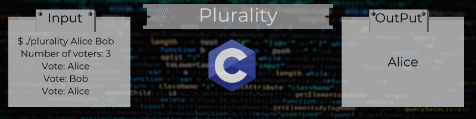
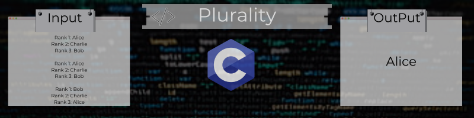

# cs50x-Algorithms
Searching: Linear Search, Binary Search. Sorting: Bubble Sort, Selection Sort, Merge Sort. Asymptotic Notation, Recursion.

## Third Week Projects:

## Lab

### [Sort](https://github.com/Henalecam/cs50x-Algorithms/tree/main/sort)

The program we’ll write will be called **sort**. And it will **implement three sorting algorithms**.

## Problems

### [Plurality](https://github.com/Henalecam/cs50x-Algorithms/tree/main/plurality)

The program we’ll write will be called **plurality**. And it will **run a plurality election**.

### [Runoff](https://github.com/Henalecam/cs50x-Algorithms/tree/main/runoff)

The program we’ll write will be called **runoff**. And it will **run a runoff election**.

